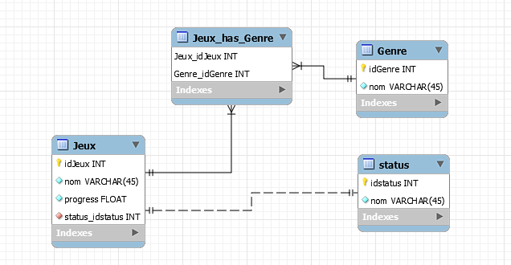

# **Squelette du site**

### **Contenu**
- [**Squelette du site**](#squelette-du-site)
    - [**Contenu**](#contenu)
  - [**Description**](#description)
      - [Technologie](#technologie)
  - [##  **– Modèle entité association**](#---modèle-entité-association)
  

---
## **Description**

MySQL Workbench est un outil de conception visuelle de base de données qui intègre le développement SQL, l'administration, la conception, la création et la maintenance de bases de données dans un environnement de développement intégré unique pour le système de base de données MySQL

#### Technologie
- MySQLWorkbench

[Retour au sommet](#squelette-du-site)

---
##  **– Modèle entité association**
---

