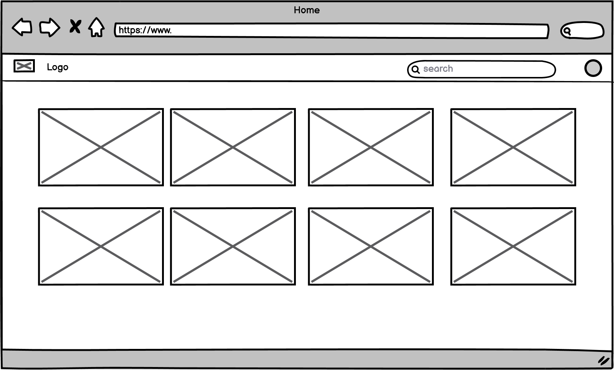
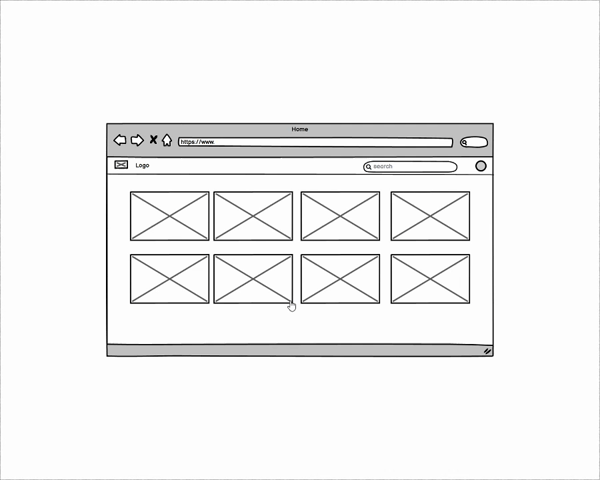
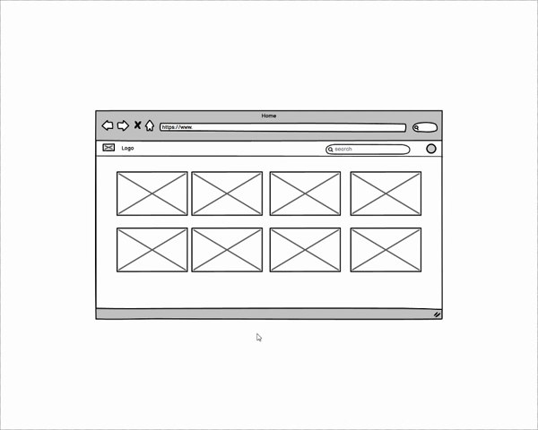
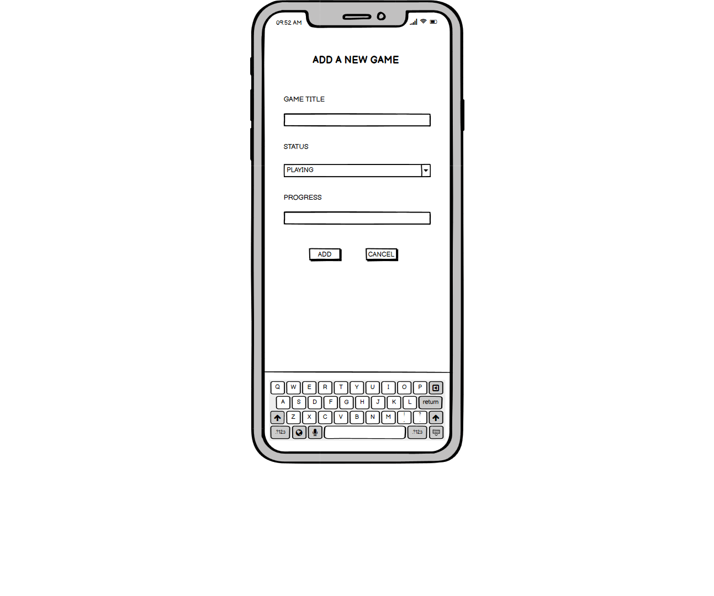
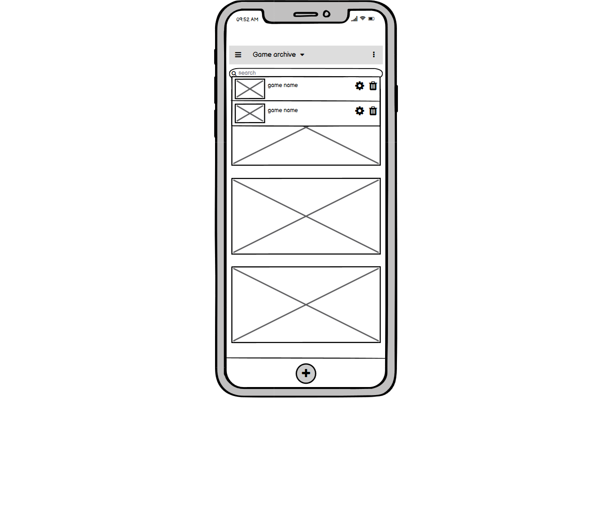
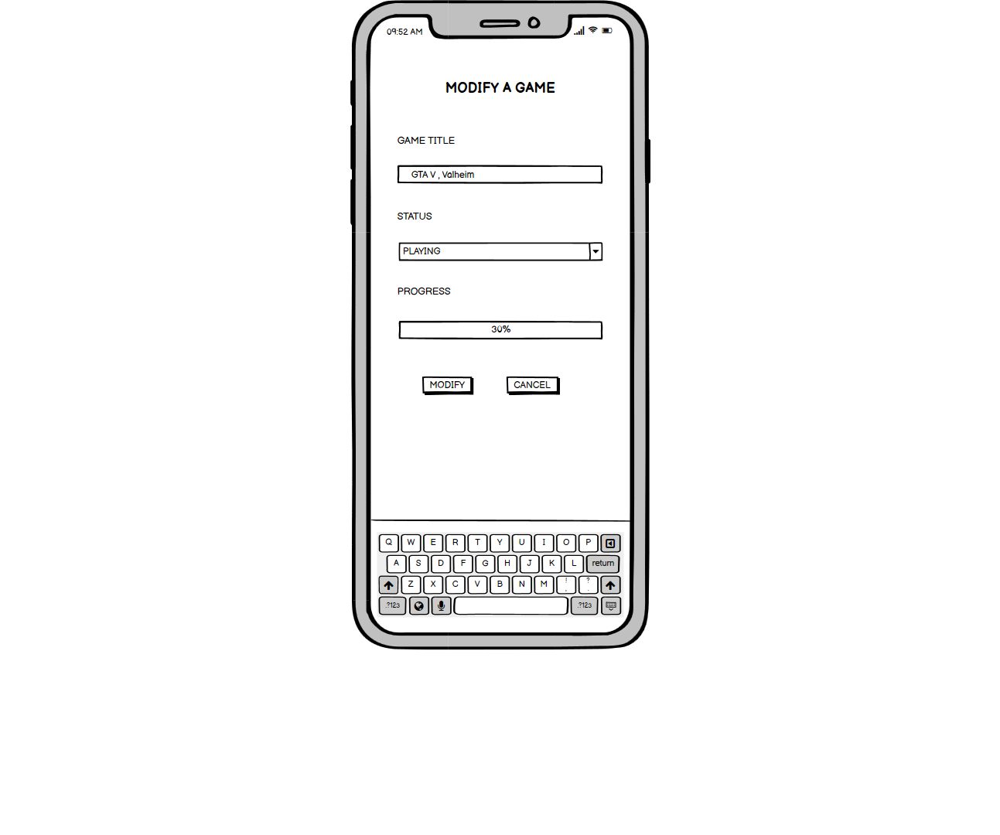
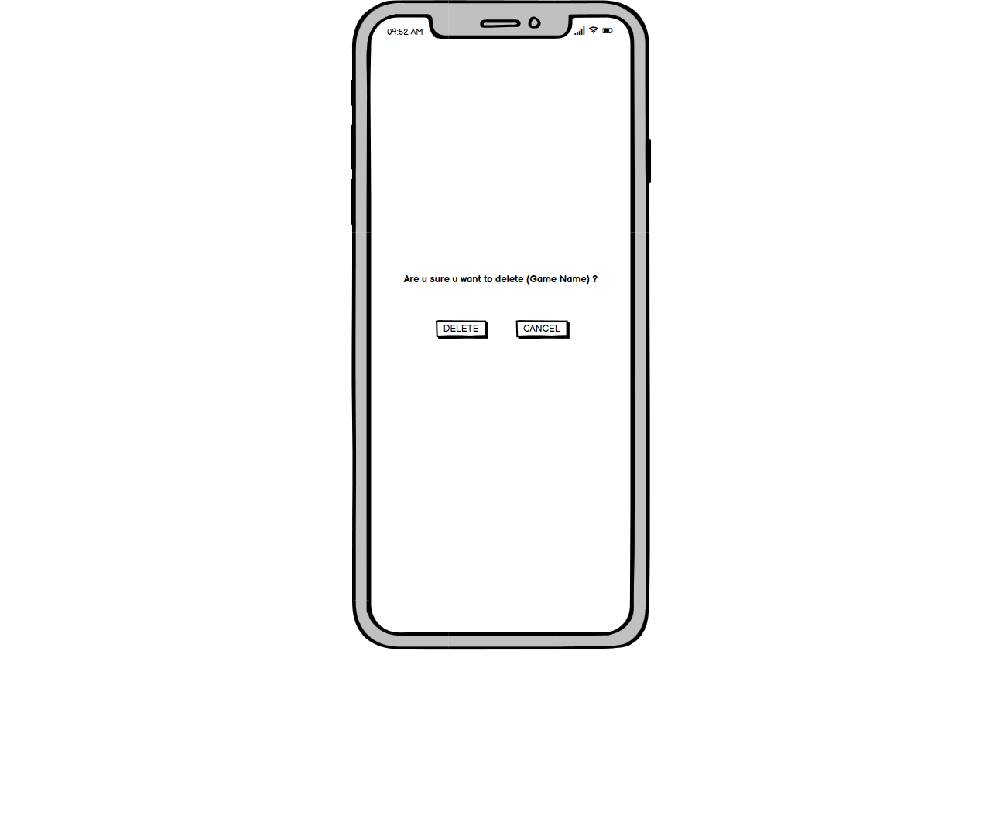
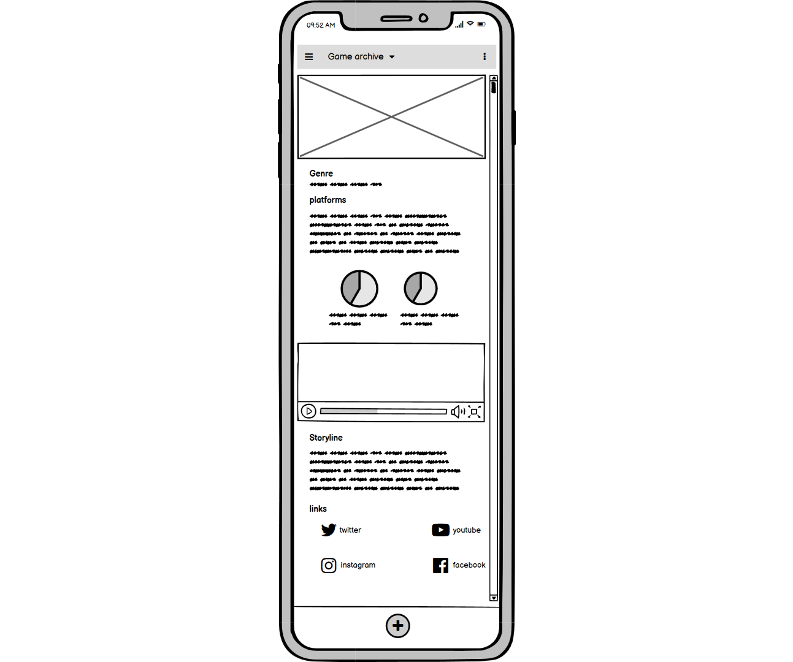

# **Squelette du site**
> wireframe des différent pages

### **Contenu**
- [**Squelette du site**](#squelette-du-site)
    - [**Contenu**](#contenu)
  - [**Description**](#description)
      - [Technologie](#technologie)
  - [**Les interfaces**](#les-interfaces)
  - [### **Desktop**](#-desktop)
      - [**Page Accueil**](#page-accueil)
      - [**Modal Ajout**](#modal-ajout)
        - [Page](#page)
        - [demo](#demo)
      - [**Modal Consulter**](#modal-consulter)
        - [Page](#page-1)
        - [demo](#demo-1)
      - [**Modal Modifier**](#modal-modifier)
        - [Page](#page-2)
        - [demo](#demo-2)
      - [**Page Info**](#page-info)
        - [Page](#page-3)
        - [demo](#demo-3)
  - [**Mobile**](#mobile)
      - [**Page Accueil**](#page-accueil-1)
        - [Page](#page-4)
      - [**Modal ajouter**](#modal-ajouter)
        - [Page](#page-5)
      - [**Modal consulter**](#modal-consulter-1)
        - [Page](#page-6)
      - [**Modal modifier**](#modal-modifier-1)
        - [Page](#page-7)
      - [**Modal supprimer**](#modal-supprimer)
        - [Page](#page-8)
      - [**Modal info**](#modal-info)
        - [Page](#page-9)
  

---
## **Description**

Un wireframe est une illustration en deux dimensions de l'interface d'une page qui se concentre spécifiquement sur l'allocation d'espace et la priorisation du contenu, des fonctionnalités disponibles et des comportements prévus. Pour ces raisons, les wireframes n'incluent généralement aucun style, couleur ou graphique.

#### Technologie
- Balsamiq

[Retour au sommet](#squelette-du-site)

---
##  **Les interfaces**

### **Desktop**
---

#### **Page Accueil**

On a une simple page Avec :
- barre de navigation
  - un logo
  - barre de recherche
  - Button Ajouter
- Corps 
  - une grille de cartes

> en appuyant sur une carte on peut accéder à sa page info  

[Retour au sommet](#squelette-du-site)

---

#### **Modal Ajout**

On a le meme [barre de navigation](#Page-Accueil).  
En cliquant sur le bouton "ajouter" / "+" un modal "Ajouter" apparaît.  
- modal Ajouter jeu
  - Form
    - input Nom de jeux
    - Select status
    - input Progres
    - Button Ajouter
    - Button Annuler

##### Page
  

---
##### demo

[Retour au sommet](#squelette-du-site)

---

#### **Modal Consulter**
> On peut aussi supprimer un jeu ici  

On a le meme [barre de navigation](#Page-Accueil).  
Après avoir tapé le nom d'un jeu donné dans la barre de recherche puis appuyée sur entrée un modal "Consulter" apparaît.  
- modal Consulter jeu
  - Nom de jeux
  - status
  - Progres
  - Button Modifier
  - Button Supprimer
  - Button Annuler

##### Page
  

---
##### demo

[Retour au sommet](#squelette-du-site)

---

#### **Modal Modifier**

On a le meme [barre de navigation](#Page-Accueil).  
après avoir appuyé sur le bouton Modifier ([Voir Page Consulter](#Modal-Consulter))  
un modal "Consulter" apparaît.  

- modal Modifier jeu
  - Form
    - input Nom de jeux
    - Select status
    - input Progres
    - Button Modifier
    - Button Annuler

##### Page
  

---
##### demo

[Retour au sommet](#squelette-du-site)

---

#### **Page Info**

On a le meme [barre de navigation](#Page-Accueil).  

- Corps
  - Section "Page Top"
    - Une image Grand taille
    - Nom de jeu
    - Date de sortie
  - Section "Info"
    - partie 1
      - Une affiche de jeu
      - Genre
      - Plateformes
      - Description
    - partie 2
      - Évaluations
      - Diagramme circulaire
      - évaluation des critiques
      - évaluation des membres
  - Section "ArtWork"
    - captures d'écran / Bande-annonce
  - Section "Autre"
    - scénario
    - les lien utils

##### Page
  

---
##### demo

[Retour au sommet](#squelette-du-site)

---

##  **Mobile**

#### **Page Accueil**
##### Page
  

[Retour au sommet](#squelette-du-site)

---

#### **Modal ajouter**
##### Page
  

[Retour au sommet](#squelette-du-site)

---
#### **Modal consulter**
##### Page
  

[Retour au sommet](#squelette-du-site)

---

#### **Modal modifier**
##### Page
  

[Retour au sommet](#squelette-du-site)

---

#### **Modal supprimer**
##### Page
  

[Retour au sommet](#squelette-du-site)

---

#### **Modal info**
##### Page
  

[Retour au sommet](#squelette-du-site)

---
