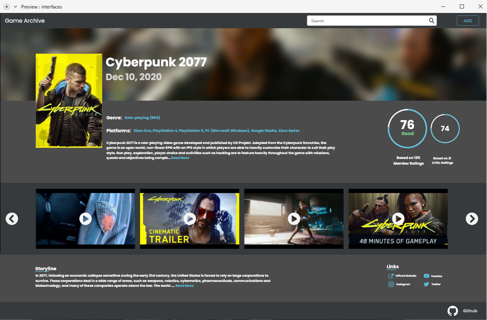

# **Squelette du site**
> prototype des différent pages

### **Contenu**
- [**Squelette du site**](#squelette-du-site)
    - [**Contenu**](#contenu)
  - [**Description**](#description)
      - [Technologie](#technologie)
  - [**Les interfaces**](#les-interfaces)
  - [### **Desktop**](#-desktop)
      - [**Page Accueil**](#page-accueil)
      - [**Modal Ajout**](#modal-ajout)
        - [Page](#page)
      - [**Modal Consulter**](#modal-consulter)
        - [Page](#page-1)
      - [**Modal Modifier**](#modal-modifier)
        - [Page](#page-2)
      - [**Page Info**](#page-info)
        - [Page](#page-3)
      - [**demo**](#demo)
  - [**Mobile**](#mobile)
      - [**Page Accueil**](#page-accueil-1)
        - [Page](#page-4)
      - [**Modal ajouter**](#modal-ajouter)
        - [Page](#page-5)
      - [**Modal consulter**](#modal-consulter-1)
        - [Page](#page-6)
      - [**Modal modifier**](#modal-modifier-1)
        - [Page](#page-7)
      - [**Modal supprimer**](#modal-supprimer)
        - [Page](#page-8)
      - [**Modal info**](#modal-info)
        - [Page](#page-9)
      - [**demo**](#demo-1)
  

---
## **Description**

Adobe XD est l'outil de prototypage Adobe destiné aux concepteurs d'expérience utilisateur et d'interaction. Les fonctionnalités d'Adobe XD sont utilisées pour créer des wireframes, des prototypes et des conceptions d'écran pour des produits numériques tels que des sites Web et des applications mobiles

#### Technologie
- Adobe xD

[Retour au sommet](#squelette-du-site)

---
##  **Les interfaces**

### **Desktop**
---

#### **Page Accueil**
> en appuyant sur une carte on peut accéder à sa page info  

   

[Retour au sommet](#squelette-du-site)

---

#### **Modal Ajout**
##### Page
  

[Retour au sommet](#squelette-du-site)

---

#### **Modal Consulter**
##### Page
  

[Retour au sommet](#squelette-du-site)

---

#### **Modal Modifier**
##### Page
  

[Retour au sommet](#squelette-du-site)

---

#### **Page Info**

##### Page
  

[Retour au sommet](#squelette-du-site)

---

#### **demo**

[Retour au sommet](#squelette-du-site)

---
##  **Mobile**

#### **Page Accueil**
##### Page
  
  

[Retour au sommet](#squelette-du-site)

---

#### **Modal ajouter**
##### Page
  

[Retour au sommet](#squelette-du-site)

---
#### **Modal consulter**
##### Page
  

[Retour au sommet](#squelette-du-site)

---

#### **Modal modifier**
##### Page
  

[Retour au sommet](#squelette-du-site)

---

#### **Modal supprimer**
##### Page
  

[Retour au sommet](#squelette-du-site)

---

#### **Modal info**
##### Page
  

[Retour au sommet](#squelette-du-site)

---

#### **demo**

[Retour au sommet](#squelette-du-site)

---
